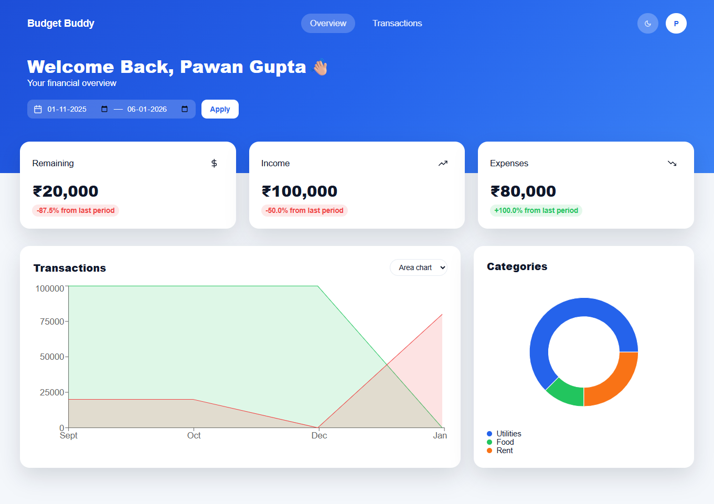
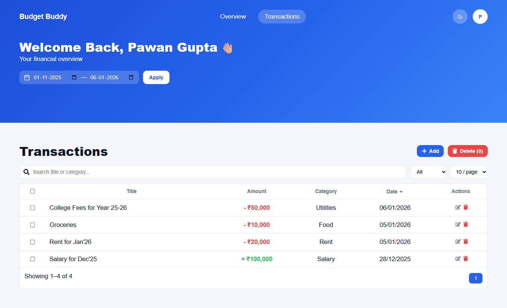
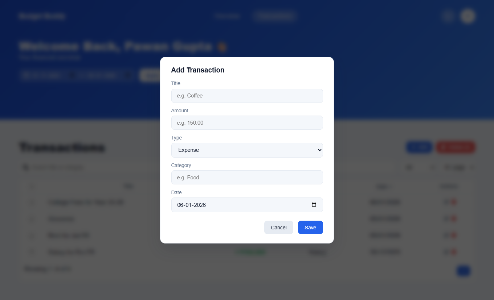
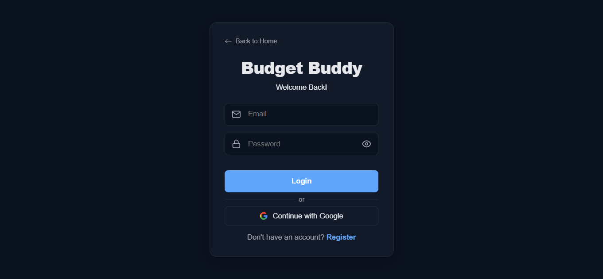

# 💰 Budget Buddy – Personal Finance Management Application

**Budget Buddy** is a modern, full-stack **personal finance management system** designed to help users track income and expenses, analyze spending behavior, and gain meaningful financial insights.

The application follows a clean **REST-based architecture**, with a **Spring Boot** backend and a **React (Vite)** frontend, secured using **JWT authentication** and **Google OAuth 2.0**.

---

## 🖼️ App Screenshots

### 🟦 Dashboard

### 📄 Transactions Page

### ➕ Add / Edit Transaction Modal

### 🔐 Login Page

---

## 🚀 Features

### 🔐 Authentication & Security
- JWT-based authentication
- Google OAuth 2.0 login
- Secure role-based API access
- Stateless session management
- Password hashing using BCrypt
- Protected routes via Spring Security filter chain

### 📊 Dashboard Overview
Comprehensive financial snapshot including:
- 💰 Current Balance
- 📥 Total Income
- 📤 Total Expenses
- 🗂 Category-wise Expense Breakdown
- 📆 Monthly Income vs Expense Analytics

### 💸 Transactions Module
- Add / Edit / Delete transactions
- Bulk delete with confirmation modal
- Income & expense categorization
- Search, filter, sort, and paginate transactions
- Optimized REST APIs for large datasets

### 🎨 UI & UX
- Clean and responsive UI
- Dark / Light theme using CSS variables
- Mobile-friendly layouts
- Reusable modal components
- Optimized tables with sorting and pagination

---

## ⚙️ Backend API (Spring Boot)
- Secure REST APIs with JWT authentication
- CRUD operations for Transactions and Categories
- Analytics APIs for:
  - Income & expense aggregation
  - Category-wise spending
  - Monthly analytics
- OAuth 2.0 authentication flow with Google
- Global exception handling

---

## 🗃 Database (PostgreSQL + JPA)
- Normalized relational schema
- Entity relationships using Hibernate
- Optimized queries with Spring Data JPA
- Secure user-level data isolation

---

## 🛠 Tech Stack

### Frontend
- React
- React Router
- Axios
- Vite
- CSS Variables (Theme System)

### Backend
- Spring Boot
- Spring Security
- Spring Data JPA
- Hibernate
- JWT
- OAuth 2.0 (Google)

### Database
- PostgreSQL

### Deployment
- Frontend: Vercel
- Backend: Render
- Database: Render / Cloud PostgreSQL

---

## 🔑 Authentication Flow

### Email & Password
1. User logs in via `/users/login`
2. Backend generates JWT
3. Token stored in `localStorage`
4. Token attached to every API request via Axios interceptor

### Google OAuth
1. User clicks **Continue with Google**
2. Redirects to `/oauth2/authorization/google`
3. Google authentication handled by Spring Security
4. Backend generates JWT
5. Redirects to frontend with token

---

## ▶️ Getting Started

## 🧪 Local Development Setup

This repository contains **both backend and frontend** in a single repository:

- `BudgetBuddyBackend` → Spring Boot backend  
- `budget-buddy-frontend` → React (Vite) frontend  

---

## 📥 Clone the Repository

git clone https://github.com/pawang001/budget-buddy.git  
cd budget-buddy  

---

## 🔧 Backend (Spring Boot)

cd BudgetBuddyBackend  
mvn spring-boot:run  

The backend will start on the configured port (default: 8080).

---

## 🎨 Frontend (React + Vite)

cd ../budget-buddy-frontend  
npm install  
npm run dev  

The frontend will start on http://localhost:5173 by default.

---

## ⚙️ Environment Variables

### Frontend (.env)

Create a `.env` file inside `budget-buddy-frontend`:

VITE_API_BASE_URL=https://your-backend-url/api  
VITE_BACKEND_URL=https://your-backend-url  

---

### Backend (application.properties)

Update `src/main/resources/application.properties`:

spring.datasource.url=jdbc:postgresql://<host>:<port>/<database>  
spring.datasource.username=<db_username>  
spring.datasource.password=<db_password>  

app.frontend.url=https://your-frontend-url  

spring.security.oauth2.client.registration.google.client-id=<google-client-id>  
spring.security.oauth2.client.registration.google.client-secret=<google-client-secret>  

---

## ✅ Notes

- Ensure PostgreSQL is running before starting the backend.
- Replace all placeholder values with your actual configuration.
- Google OAuth requires valid credentials from the Google Cloud Console.

---

## 🔄 Useful Scripts

| Script | Description |
|--------|-------------|
| `npm run dev` | Start dev server |
| `npm run build` | Build production |
| `npm run start` | Start production server |

---
 
## 📘 Learning Highlights

This project demonstrates:

- Full-stack application design using **Spring Boot + React**
- Secure authentication with **JWT** and **Google OAuth 2.0**
- Stateless API security using **Spring Security filter chain**
- Role-based authorization and protected REST endpoints
- Clean RESTful API design with proper **controller–service layering**
- Financial analytics powered by **aggregated database queries**
- **Axios interceptors** for automatic JWT token handling
- Client-side routing with **protected routes**
- Reusable and scalable **React component architecture**
- Theme management using **CSS variables**
- Clean and consistent UX patterns with **modals and confirmation dialogs**

---

## ⭐ Contribute
Pull requests and feature suggestions are welcome!

---

## 📄 License
MIT License ©️ 2025
